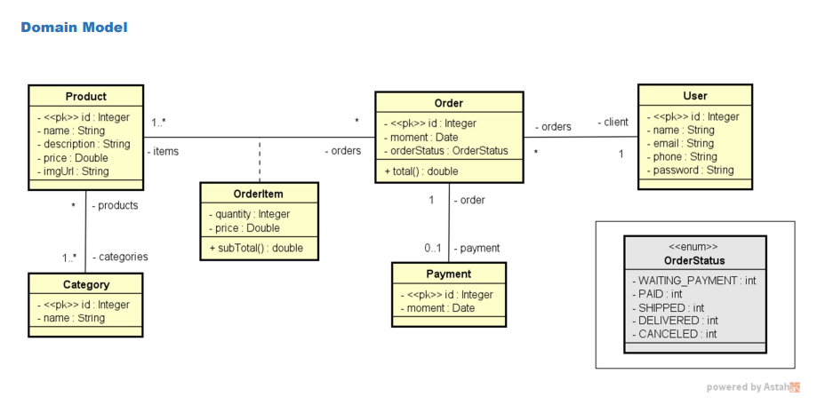
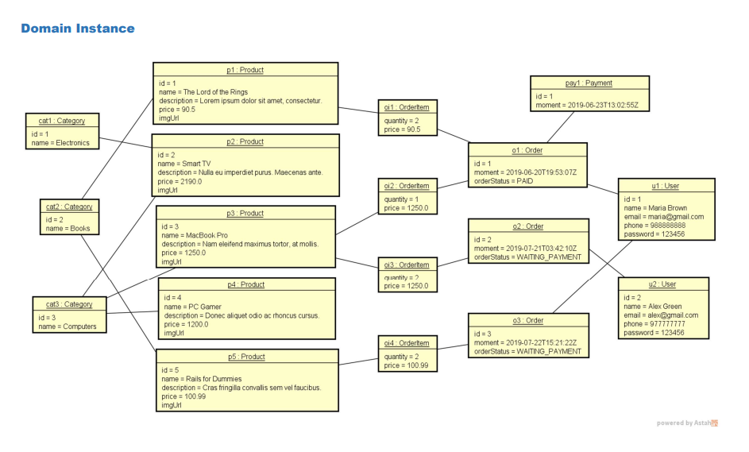
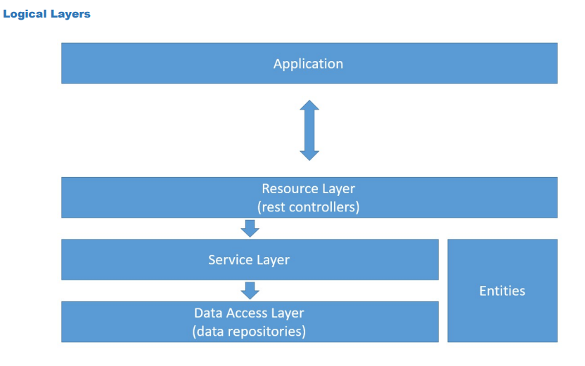

# Workshop Spring Boot 4 - JPA

# Sobre o projeto

Este projeto foi desenvolvido durante o curso Curso Java COMPLETO – Programação Orientada a Objetos + Projetos, do professor Nelio Alves

O objetivo do projeto é construir uma API REST com Spring Boot, utilizando JPA / Hibernate, aplicando boas práticas de arquitetura em camadas e realizando operações CRUD completas, além de tratamento de exceções.

## Modelo conceitual
O modelo conceitual representa as entidades do sistema e seus relacionamentos.

  

## Domain Instance

Exemplo de instância do domínio com dados previamente populados.

  

## Camadas Lógicas (Logical Layers)

Arquitetura organizada em camadas:

- Resource (Controller)
- Service
- Repository
- Entities

  

# Tecnologias utilizadas

### Back end
- Java 17
- Spring Boot
- JPA / Hibernate
- Maven
- H2 Database
- PostgreSQL

### Ferramentas
- IntelliJ IDEA
- Postman
- Git
- GitHub

# Como executar o projeto

## 🔹 Pré-requisitos

- Java 17+
- Maven
- PostgreSQL (opcional para profile dev)

---

## 🔹 Executando com H2 (perfil de teste)

O projeto está configurado para rodar com banco H2 em memória no profile `test`.

No arquivo `application.properties`:

spring.profiles.active=test

Execute o projeto:

./mvnw spring-boot:run

Ou pela sua IDE (IntelliJ).

Acesse o console do H2:

http://localhost:8080/h2-console

Configurações do H2:

- JDBC URL: jdbc:h2:mem:testdb
- User: sa
- Password: (vazio)

---

## 🔹 Executando com PostgreSQL (perfil dev)

Crie um banco no PostgreSQL:

create database springboot_course;

Configure o arquivo `application-dev.properties`:

spring.datasource.url=jdbc:postgresql://localhost:5432/springboot_course
spring.datasource.username=postgres
spring.datasource.password=1234567
spring.jpa.hibernate.ddl-auto=update

Depois altere no `application.properties`:

spring.profiles.active=dev

Execute normalmente a aplicação.

# Funcionalidades

- CRUD completo de usuários
- Relacionamentos One-to-Many, Many-to-Many e One-to-One
- Enum para status de pedido
- Tratamento de exceções personalizado
- Perfis de ambiente (test, dev, prod)
- Banco H2 para testes
- PostgreSQL para desenvolvimento

---

# 👨‍💻 Autor

Marlon Reis

🔗 Linkedin:  
https://www.linkedin.com/in/marlon-reis-dev/
---

Projeto desenvolvido para fins de estudo e aprimoramento em Spring Boot e arquitetura em camadas.

